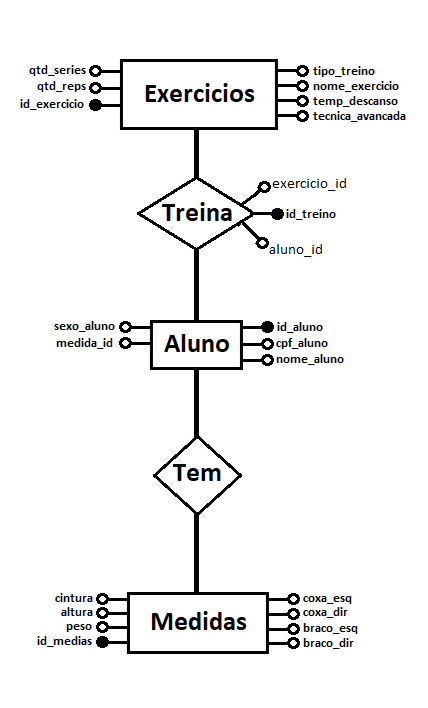

# Proejto parte 1 da disciplina de banco de dados 

Disciplina Ministrada pelo professor  MARCELO IURY DE SOUSA OLIVEIRA  

Sistema que gerencia alunos de um personal trainer

# Modelagem UML

## Diagrama Entidade_Relacionamento

## Modelagem Relacional
**Exercicios(<ins>id_exercicio</ins>, nome_exercicio, qtd_series, qtd_reps, tecnica_avancada, temp_descanso, tipo_treino)**

**Treino(<ins>id_treino</ins>, aluno_id, exercicio_id)**

**Aluno(<ins>id_aluno</ins>, nome_aluno, cpf_aluno, sexo_aluno, medida_id)**

**Medidas(<ins>id_medida</ins>, altura, peso, cintura, coxa_esq, coxa_dir, braco_esq, braco_dir)**

# Tecnologias utilizadas:

- Linguagem de Programação - <a href="www.python.org">Python</a> 
- Query Builder - <a href="https://www.psycopg.org/"> Psycopg</a> 
- SGBD - <a href="www.postgresql.org"> PostgreSQL</a> 